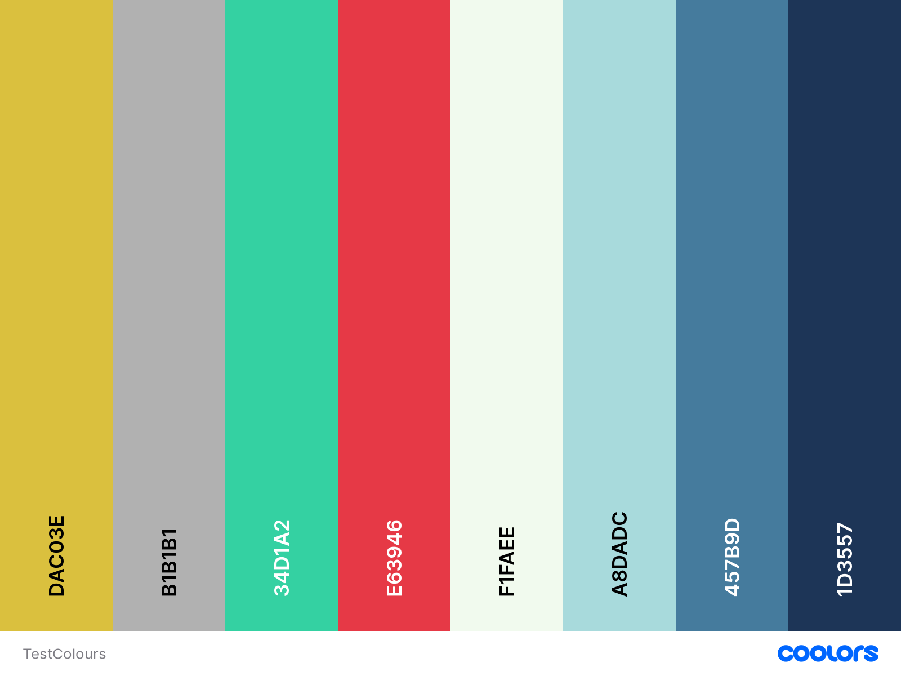

# What's Cooking!

Click the link to view the live app [What's Cooking](https://whats-cooking.herokuapp.com/)

Making recipes by putting ingredients first and sharing recipes between the Whats Cooking community.

Welcome to the social recipe app, a platform for food enthusiasts to come together and share their culinary creations. Built using the powerful Django framework, this app allows users to create their own profiles and save their favourite recipes and chefs. With a focus on community, users can share their recipes and connect with others who share their love of food. Whether you're an experienced cook or just starting out, this app is a great way to discover new recipes, get inspired, and connect with others in the foodie community.

***

## Contents
* [About What's Cooking](#Introduction)
* [How To Use It](#how-to-use-it)
* [User Story](#User-Stories)
* [Design](#Design)
* [ERD](#ERD)
* [Wireframes](#Wireframes)
* [Navigation Plan](#Navigation-Plan)
* [Colour Scheme](#Colour-Scheme)
* [Fonts](#Fonts)
* [Features](#features)
    * [Existing Features](#Existing-Features)
    * [Future Features](#future-features)
* [Testing](#testing)
    * [Manual Testing](#manual-testing)
    * [User Story Testing](#user-story-testing)
    * [Validator](#validatiors)
* [Solved Bugs](#solved-bugs)
* [Deployment](#Deployment-Incomplete!!!)
    * [Cloning & Forking](#cloning--forking)
    * [Local Deployment](#local-deployment)
    * [Remote Deployment](#remote-deployment)
    * [Google Sheets](#google-sheet)
* [Credits / Acknowledgements](#credits--acknowledgement)

***

## Project Aims
- Provide a platform for users to share their own recipes and connect with others in the foodie community.

- Allow users to save and organize their favourite recipes and chefs in one convenient location.

- Encourage community engagement by allowing users to like, comment on, and rate recipes.

- Make it easy for users to discover new and exciting recipes by offering a variety of search and filter options.

- Provide a visually appealing and user-friendly interface that makes it easy for users to navigate the app and find what they're looking for.

- Ensure that the app is scalable and can handle an increasing number of users and recipes over time.

- Offer robust security features to protect user data and ensure that the app complies with privacy regulations.

- Continuously improve the app through regular updates and bug fixes based on user feedback.

Overall, the goal of the social recipe app is to create a vibrant and engaged community of food lovers who can share their passion for cooking and discover new recipes and chefs.

## How to use it

Here are the steps to use **What's Cooking**:

1. Create an account: To get started, you will need to create an account by entering your email address, and password.

2. Update your profile: After creating an account, you can update your profile information, with personal information, such as your name, profile picture and bio, to help others get to know you better.

3. Browse recipes: You can start browsing the site's recipes by visiting the "Recipes" page. Here, you will see a list of all the recipes available on the site.

4. Filter recipes: If you are looking for a specific type of recipe, you can use the filtering options to narrow down the list of recipes based on ingredients or sort by another criteria.

5. View a recipe: To view a recipe, simply click on its title. You will be taken to a page that displays detailed information about the recipe, including ingredients, instructions, images and user reviews.

6. Leave a review: If you have tried a recipe, you can leave a review by clicking the "Leave a Comment" button on the recipe page. Enter your review and click "Submit.". You can also rate the recipe out of 5 and upload a image of the meal you cooked.

7. Like and save recipes: If you like a recipe, you can click the "Like" button to show your appreciation, this will also save recipes to your personal collection so you can eaily view it from your profile page.

8. Upload your own recipe: To share your own cooking skills with others, click the "Upload Recipe" button and follow the prompts to enter information about your recipe, including the ingredients, instructions, and a photo.

9. View your saved recipes: To view the recipes you have saved, go to your profile and click on the "My Recipes" section.

10. Follow other users: If you want to keep up with the recipes shared by other users, you can follow them by clicking the "Follow" button on their profiles.

With these steps, you should be able to easily use **What's Cooking** to find, share, and discover new recipes.

## User Stories & Epics

### Epic: Authentication: The ability for users to create and manage their own profiles, including updating their information and viewing their saved recipes.
- 26 - As a Site User I can register an account so that I can use the site to share and view recipes.
- 33 - As a Site User I can log into an account so that I can view all my recipes.

### Epic: Account Management
- 31 - As a user, I want to be able to update my profile information so that my followers can get to know me better.

### Epic: Account Interactions
- 34 - As a Site User I can follow and unfollow another users account so that I can view all their recipes or I can stop following a user.

### Epic: Recipe Management: The ability for users to create, upload, view, and delete recipes on the app.
- 7 - As a Site User I can create draft recipes so that I can finish writing the content later.
- 8 - As a Site User I can add new ingredients to the main list so that I can use them in my recipes.
- 10 - As a Site User I can add ingredients to a recipe so that readers know what they will need for the recipe.
- 11 - As a Site User I can add instructions on how to cook a recipe so that users can follow and make the recipe.
- 12 - As a Site User I can post a recipe so that users can view the recipe and try and make it them self.
- 30 - As a Site User I can create, read, update and delete posts that I manage so that I can manage my recipe content.

### Epic: Recipe Discovery: The ability for users to discover new recipes by browsing the list of recipes, filtering by ingredients, and viewing detailed information about a recipe.
- 16 - As a Site User I can search for recipes so that I can interact and save the recipe to make.
- 17 - As a Site User I can search for recipes with ingredients so that I can interact and save the recipe to make.
- 19 - As a Site User I can view a paginated list of recipes so that I can easily select a recipe to view.
- 20 - As a Site User I can view a paginated list of ingredients so that I can easily select an ingredient to view recipes linked to it.
- 21 - As a Site User I can view a list of recipes so that I can easily select a recipe to read.
- 22 - As a Site User I can view a list of ingredients so that I can easily select an ingredient to read.
- 23 - As a Site User I can view the number of favourites on each recipe so that I can see which is the most popular or viral.
- 24 - As a Site User I can view the most popular recipes so that I can try the recipes.
- 25 - As a Site User I can view the 5 top recipes so that I can try the most popular recipes.
- 29 - As a Site User I can click on a recipe title so that I can read the full recipe.
- 32 - As a user, I want to be able to view detailed information about a recipe, including the ingredients, instructions, and user reviews, so that I can decide if I want to make the recipe.

### Epic: User Interactions: The ability for users to interact with each other by liking and saving recipes, leaving reviews, and following other users.
- 6 - As a Site User I can view comments on an individual recipes so that I can read the conversations.
- 15 - As a Site User I can favourite/ unfavourite recipes so that I can interact and save the recipe to make.
- 18 - As a Site User I can leave a comment on a recipe so that I can leave a review on the recipe and give feedback.
- 28 - As a Site User I can view comments on an individual recipe so that I can read the conversations and reviews.
- 35 - As a Site User I can upload pictures of the recipe if I have tried to make it. so that users can see and example of the meal.
### Epic: Notifications

### Epic: Application Configuration
- 1 - As a Site Admin I can approve or disapprove comments so that I can filter out objectionable comments.
- 2 - As a Site Admin I can approve or disapprove ingredients so that I can filter out objectionable ingredients.
- 3 - As a Site Admin I can remove recipes so that I can filter out objectionable recipes.
- 4 - As a Site Admin I can view the number of favourites on each post so that I can see which is the most popular or viral.
- 5 - As a Site Admin I can create, read, update and delete recipes so that I can manage my app content

### To Do
- 14 - As a Site User I can print/ export a recipe so that I can use it when i want to make the recipe.
- 27 - As a Site User I can view the top 5 ingredients used in recipes so that I know what ingredients I will use the most.
- - As a Site User I can register for an account using social media so that I can quickly make an account with all user details transfered.
***

### Incomplete User Stories for future developement
9 - As a Site User I can add new ingredients to my shopping list so that I can know what I need to purchase to make the meal.
13 - As a Site User I can print/ export my shopping list so that I can know what I need to purchase to make the meal.

These are discussed more in the [Future Features](#future-features) section. 

***

## Design
### ERD


### Wireframes
#### Index
Mobile
<details>
<summary>Click to view</summary>

</details>

Desktop
<details>
<summary>Click to view</summary>

</details>

#### Shopping List
Mobile
<details>
<summary>Click to view</summary>

</details>
Desktop
<details>
<summary>Click to view</summary>

</details>

#### Logged In Recipe List
Mobile
<details>
<summary>Click to view</summary>

</details>
Desktop
<details>
<summary>Click to view</summary>

</details>

#### Login
Mobile
<details>
<summary>Click to view</summary>

</details>
Desktop
<details>
<summary>Click to view</summary>

</details>

#### New Recipe
Mobile
<details>
<summary>Click to view</summary>

</details>
Desktop
<details>
<summary>Click to view</summary>

</details>

#### Search Ingridents
<details>
<summary>Click to view</summary>

</details>

#### Add New Instruction
<details>
<summary>Click to view</summary>

</details>

### Navigation Plan


### Colour Scheme


### Fonts
Google fonts was used in this project with both fonts selected for their legibility and simplicity.

***** - Use in headings.
***** - Use in paragraphs and labels.

***

## Features
### Existing Features

#### Base
##### NavBar
- A logo image and brand name link to the home page, with two variations of the brand name text (full and shortened).
- A toggle button to expand/collapse the navigation links in a dropdown menu.
- Links for the home and recipes pages, which are active if the current page is the respective one.
- Conditional links for user authentication: profile page or profile toggle button if the user is logged in, or register and login links if the user is not logged in.

+++ An Image here +++

+++ An Image here +++

##### Messages
- A container with a row and a column that takes up 8 of 12 columns on medium-sized screens and is offset by 2 columns.
- A loop that iterates over the messages passed from the views.
- An alert for each message, with a class assigned based on the message's tags (e.g., success, warning, error). The message is displayed in a safe manner to prevent malicious content.
- A close button for each alert using Bootstrap's data-bs-dismiss attribute.

+++ An Image here +++

##### Profile Section
- A profle sectionm that is only accessible when the user is logged in.
- Shows user account details. It shows the users status and how far they are from the next level. If the user has not completed their account then it will show a button to link the user to the complete account section.
- Quick links to favourite recipes, recipes made by the user and the users that the user follows.
- There is a button which links to the user profile and a logout button


+++ An Image here +++

+++ An Image here +++

##### Footer
- The footer contains two paragraphs of text and icons.
- The first paragraph displays a link to the author's Github account, and the second paragraph displays social media icons.
- The footer has a background color of "footer-bg" and uses font awesome icons to display the social media icons.

+++ An Image here +++

#### Index
- A carousel is created to display 3 featured recipes with their corresponding images and captions.
- Indicators are added to show which image is currently being displayed in the carousel.
- A "sign up" button is added to the carousel that links to the login/sign up page if the user is not already authenticated.
- A section is added that introduces the website and its purpose.
- Another section is added that explains why the user should sign up for the website.
- A bulleted list is included with reasons to sign up, such as access to an extensive recipe database, ability to save favorite recipes, and share recipes with the community.
- The page shows the top three liked recipes with the author of the recipe, description and the average rating.

+++ An Image here +++

#### Signup, Login and other account management pages

+++ An Image here +++

+++ An Image here +++

Recipe list

Filters and search

Recipe management

Recipe interactions

Profile management

Profile pages

Profile interactions

### Future Features

Shopping list
Due to time constraints this feature could not be completed for this release

More social login options
Due to time constraints this feature could not be completed for this release

***

## Testing 

A separate testing document has been created as TESTING.md

### Manual Testing
### User Story Testing
### Validators
### Bugs
No known errors remaining.

***

## Deployment Incomplete!!!
### Cloning & Forking
#### Fork
1. On GitHub.com, navigate to the [dlhamilton/Route Me](https://github.com/dlhamilton/route-me) repository.
2. In the top-right corner of the page, click Fork.
3. By default, forks are named the same as their parent repositories. You can change the name of the fork to distinguish it further.
4. Add a description to your fork.
5. Click Create fork.

#### Clone
1. Above the list of files click the button that says 'Code'.
2. Copy the URL for the repository.
3. Open Terminal. Change the directory to the location where you want the cloned directory.
4. Type git clone, and then paste the URL
5. Press Enter.

### Local Deployment
1. Sign up to [Gitpod](https://gitpod.io/)
2. Download the Gitpod browser extension.
3. On GitHub.com, navigate to the [dlhamilton/route_me](https://github.com/dlhamilton/route-me) repository.
4. Above the list of files click the button that says 'Gitpod'.
5. Once open you will need to install the libraries, you can do this by typing "pip3 install -r requirements.txt" into the terminal

### Remote Deployment 
 The prgoram was deployed to Heroku. If you have forked/cloned the repository the steps to deploy are:
 1. On Heroku, create a new app.
 2. input a name for your app
 3. Click on the settings tab
 4. Scroll to the Config Vars and click on the "Reveal Config Vars"
 5. Input CREDS into the key field and the content of the Google API creds file into the value area.
 6. Add another config, PORT into key and 8000 into value.
 7. Set the buildbacks to Python and NodeJs in that order .
 8. Link your Heroku app to you repository.
 9. Click on Deploy.
 10. The page will then provide the url to the python terminal.

 The live link can be found here - [Route Me](https://route-me-dh.herokuapp.com/)
### Google Sheet
The program uses a Google Sheets to store saved graphs and mazes. 

1. Sign up to a [Google Account](https://support.google.com/accounts/answer/27441?hl=en#)
2. Open Google Sheets and create a new spreadsheet. [Click here for Google Sheets](https://docs.google.com/spreadsheets/)
3. Change the name of the spreadsheet to 'route_me_data'
    ```python
    SHEET = GSPREAD_CLIENT.open('route_me_data')
    ```
4. You now need to change the name of the worksheet to 'saves'
5. The google sheet is now complete

Now you need to get the API credentials from the [Google Cloud Platform](https://console.cloud.google.com/)

1. Create a new project and give it a name.
2. Select APIs and services from the navigation pane. 
3. Now click Library
4. Search for the Google Sheets and click enable.
5. Search for the google Drive API and click enable.
6. Click create credentials and from the drop down select Google dRIVE api.
7. From the form select Application data
8. Then click No for "are you planning to use this API with compute Engine, Kubernetes engine, App engine or cloud Functions?"
9. Press Create and Continue.
10. Select a role of Editor from the options and click "Done"
11. Navigate to the service account on the credentials page. 
12. On the tab click KEYS then ADD KEY.
13. The Key type will need to be JSON
14. Copy the downloaded JSON file into your repository and name it "creds.json"
15. ADD THE "creds.json" FILE TO .gitignore FILE. DO NOT SHARE PUBLICLY.

***

## Credits / Acknowledgements

- For colour pallete 
[Coolors](https://coolors.co/dac03e-b1b1b1-34d1a2-e63946-f1faee-a8dadc-457b9d-1d3557)


Delphine Hourlay
Adonyi Gábor
Klaus Nielsen
***