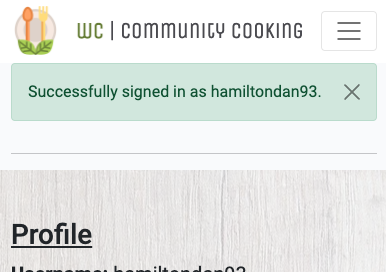
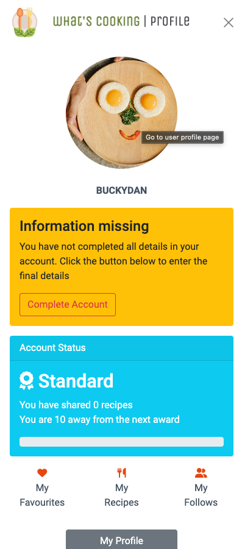
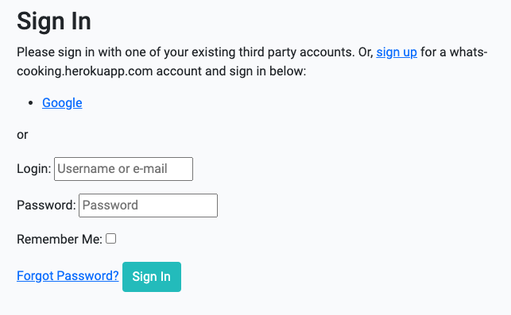
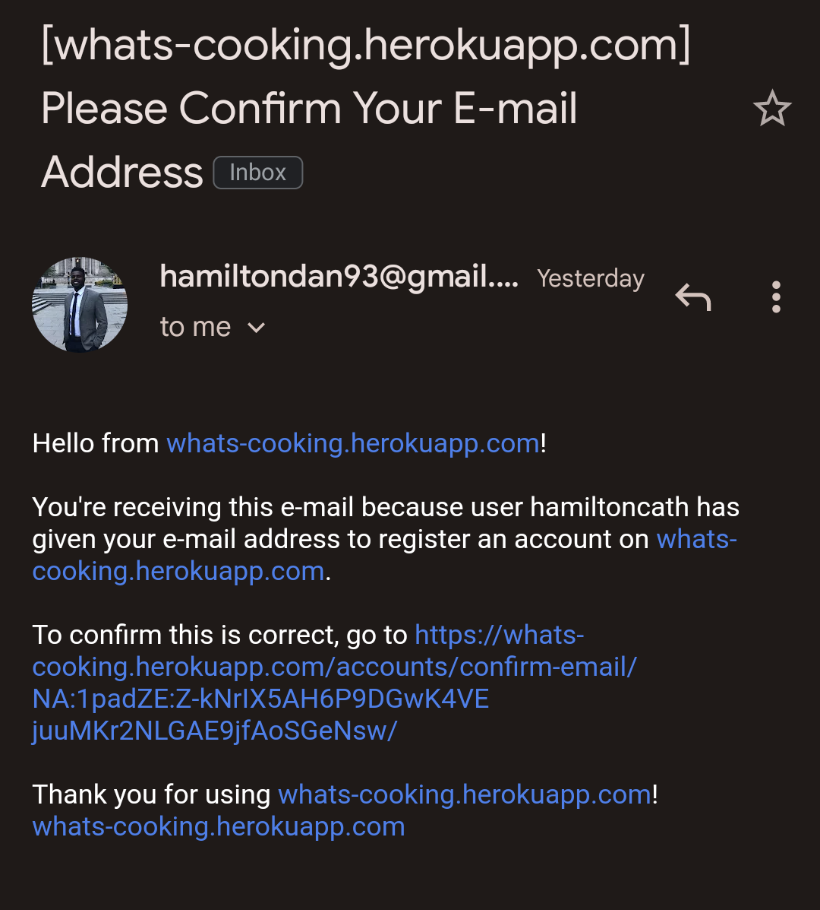

# What's Cooking!

Click the link to view the live app [What's Cooking](https://whats-cooking.herokuapp.com/)

Making recipes by putting ingredients first and sharing recipes between the Whats Cooking community.

Welcome to the social recipe app, a platform for food enthusiasts to come together and share their culinary creations. Built using the powerful Django framework, this app allows users to create their own profiles and save their favourite recipes and chefs. With a focus on community, users can share their recipes and connect with others who share their love of food. Whether you're an experienced cook or just starting out, this app is a great way to discover new recipes, get inspired, and connect with others in the foodie community.

***

## Contents
* [About What's Cooking](#Introduction)
* [How To Use It](#how-to-use-it)
* [User Story](#User-Stories)
* [Design](#Design)
* [ERD](#ERD)
* [Wireframes](#Wireframes)
* [Navigation Plan](#Navigation-Plan)
* [Colour Scheme](#Colour-Scheme)
* [Fonts](#Fonts)
* [Features](#features)
    * [Existing Features](#Existing-Features)
    * [Future Features](#future-features)
* [Technologies Used](technologies-used)
* [Testing](#testing)
    * [Manual Testing](#manual-testing)
    * [User Story Testing](#user-story-testing)
    * [Validator](#validatiors)
* [Solved Bugs](#solved-bugs)
* [Deployment](#Deployment-Incomplete!!!)
    * [Cloning & Forking](#cloning--forking)
    * [Local Deployment](#local-deployment)
    * [Remote Deployment](#remote-deployment)
    * [Google Sheets](#google-sheet)
* [Credits / Acknowledgements](#credits--acknowledgement)

***

## Project Aims
- Provide a platform for users to share their own recipes and connect with others in the foodie community.

- Allow users to save and organize their favourite recipes and chefs in one convenient location.

- Encourage community engagement by allowing users to like, comment on, and rate recipes.

- Make it easy for users to discover new and exciting recipes by offering a variety of search and filter options.

- Provide a visually appealing and user-friendly interface that makes it easy for users to navigate the app and find what they're looking for.

- Ensure that the app is scalable and can handle an increasing number of users and recipes over time.

- Offer robust security features to protect user data and ensure that the app complies with privacy regulations.

- Continuously improve the app through regular updates and bug fixes based on user feedback.

Overall, the goal of the social recipe app is to create a vibrant and engaged community of food lovers who can share their passion for cooking and discover new recipes and chefs.

## How to use it

Here are the steps to use **What's Cooking**:

1. Create an account: To get started, you will need to create an account by entering your email address, and password.

2. Update your profile: After creating an account, you can update your profile information, with personal information, such as your name, profile picture and bio, to help others get to know you better.

3. Browse recipes: You can start browsing the site's recipes by visiting the "Recipes" page. Here, you will see a list of all the recipes available on the site.

4. Filter recipes: If you are looking for a specific type of recipe, you can use the filtering options to narrow down the list of recipes based on ingredients or sort by another criteria.

5. View a recipe: To view a recipe, simply click on its title. You will be taken to a page that displays detailed information about the recipe, including ingredients, instructions, images and user reviews.

6. Leave a review: If you have tried a recipe, you can leave a review by clicking the "Leave a Comment" button on the recipe page. Enter your review and click "Submit.". You can also rate the recipe out of 5 and upload a image of the meal you cooked.

7. Like and save recipes: If you like a recipe, you can click the "Like" button to show your appreciation, this will also save recipes to your personal collection so you can eaily view it from your profile page.

8. Upload your own recipe: To share your own cooking skills with others, click the "Upload Recipe" button and follow the prompts to enter information about your recipe, including the ingredients, instructions, and a photo.

9. View your saved recipes: To view the recipes you have saved, go to your profile and click on the "My Recipes" section.

10. Follow other users: If you want to keep up with the recipes shared by other users, you can follow them by clicking the "Follow" button on their profiles.

With these steps, you should be able to easily use **What's Cooking** to find, share, and discover new recipes.

## User Stories & Epics
All user stories were entered as issues in a GitHub Kanban project follow the link to see the project:
[Project Link](https://github.com/users/dlhamilton/projects/3)

### Epic: Authentication: The ability for users to create and manage their own profiles, including updating their information and viewing their saved recipes.
- [26]([#26](https://github.com/dlhamilton/Whats-Cooking/issues/26)) - As a Site User I can register an account so that I can use the site to share and view recipes.
- [33]([#33](https://github.com/dlhamilton/Whats-Cooking/issues/33)) - As a Site User I can log into an account so that I can view all my recipes.

### Epic: Account Management
- [31]([#31](https://github.com/dlhamilton/Whats-Cooking/issues/31)) - As a user, I want to be able to update my profile information so that my followers can get to know me better.

### Epic: Account Interactions
- [34]([#34](https://github.com/dlhamilton/Whats-Cooking/issues/34)) - As a Site User I can follow and unfollow another users account so that I can view all their recipes or I can stop following a user.

### Epic: Recipe Management: The ability for users to create, upload, view, and delete recipes on the app.
- [7]([#7](https://github.com/dlhamilton/Whats-Cooking/issues/7)) - As a Site User I can create draft recipes so that I can finish writing the content later.
- [8]([#8](https://github.com/dlhamilton/Whats-Cooking/issues/8)) - As a Site User I can add new ingredients to the main list so that I can use them in my recipes.
- [10]([#10](https://github.com/dlhamilton/Whats-Cooking/issues/10)) - As a Site User I can add ingredients to a recipe so that readers know what they will need for the recipe.
- [11]([#11](https://github.com/dlhamilton/Whats-Cooking/issues/11)) - As a Site User I can add instructions on how to cook a recipe so that users can follow and make the recipe.
- [12]([#12](https://github.com/dlhamilton/Whats-Cooking/issues/12)) - As a Site User I can post a recipe so that users can view the recipe and try and make it them self.
- [30]([#30](https://github.com/dlhamilton/Whats-Cooking/issues/30)) - As a Site User I can create, read, update and delete posts that I manage so that I can manage my recipe content.

### Epic: Recipe Discovery: The ability for users to discover new recipes by browsing the list of recipes, filtering by ingredients, and viewing detailed information about a recipe.
- [16]([#16](https://github.com/dlhamilton/Whats-Cooking/issues/16)) - As a Site User I can search for recipes so that I can interact and save the recipe to make.
- [17]([#17](https://github.com/dlhamilton/Whats-Cooking/issues/17)) - As a Site User I can search for recipes with ingredients so that I can interact and save the recipe to make.
- [19]([#19](https://github.com/dlhamilton/Whats-Cooking/issues/19)) - As a Site User I can view a paginated list of recipes so that I can easily select a recipe to view.
- [20]([#20](https://github.com/dlhamilton/Whats-Cooking/issues/20)) - As a Site User I can view a paginated list of ingredients so that I can easily select an ingredient to view recipes linked to it.
- [21]([#21](https://github.com/dlhamilton/Whats-Cooking/issues/21)) - As a Site User I can view a list of recipes so that I can easily select a recipe to read.
- [22]([#22](https://github.com/dlhamilton/Whats-Cooking/issues/22)) - As a Site User I can view a list of ingredients so that I can easily select an ingredient to read.
- [23]([#23](https://github.com/dlhamilton/Whats-Cooking/issues/23)) - As a Site User I can view the number of favourites on each recipe so that I can see which is the most popular or viral.
- [24]([#24](https://github.com/dlhamilton/Whats-Cooking/issues/24)) - As a Site User I can view the most popular recipes so that I can try the recipes.
- [25]([#25](https://github.com/dlhamilton/Whats-Cooking/issues/25)) - As a Site User I can view the 5 top recipes so that I can try the most popular recipes.
- [29]([#29](https://github.com/dlhamilton/Whats-Cooking/issues/29)) - As a Site User I can click on a recipe title so that I can read the full recipe.
- [32]([#32](https://github.com/dlhamilton/Whats-Cooking/issues/32)) - As a user, I want to be able to view detailed information about a recipe, including the ingredients, instructions, and user reviews, so that I can decide if I want to make the recipe.
- [27]([#27](https://github.com/dlhamilton/Whats-Cooking/issues/27)) - As a Site User I can view the top 5 ingredients used in recipes so that I know what ingredients I will use the most.

### Epic: User Interactions: The ability for users to interact with each other by liking and saving recipes, leaving reviews, and following other users.
- [6]([#6](https://github.com/dlhamilton/Whats-Cooking/issues/6)) - As a Site User I can view comments on an individual recipes so that I can read the conversations.
- [15]([#15](https://github.com/dlhamilton/Whats-Cooking/issues/15)) - As a Site User I can favourite/ unfavourite recipes so that I can interact and save the recipe to make.
- [18]([#18](https://github.com/dlhamilton/Whats-Cooking/issues/18)) - As a Site User I can leave a comment on a recipe so that I can leave a review on the recipe and give feedback.
- [28]([#28](https://github.com/dlhamilton/Whats-Cooking/issues/28)) - As a Site User I can view comments on an individual recipe so that I can read the conversations and reviews.
- [35]([#35](https://github.com/dlhamilton/Whats-Cooking/issues/35)) - As a Site User I can upload pictures of the recipe if I have tried to make it. so that users can see and example of the meal.
- [14]([#14](https://github.com/dlhamilton/Whats-Cooking/issues/14)) - As a Site User I can print/ export a recipe so that I can use it when i want to make the recipe.

### Epic: Application Configuration
- [1]([#1](https://github.com/dlhamilton/Whats-Cooking/issues/1)) - As a Site Admin I can approve or disapprove comments so that I can filter out objectionable comments.
- [2]([#2](https://github.com/dlhamilton/Whats-Cooking/issues/2)) - As a Site Admin I can approve or disapprove ingredients so that I can filter out objectionable ingredients.
- [3]([#3](https://github.com/dlhamilton/Whats-Cooking/issues/3)) - As a Site Admin I can remove recipes so that I can filter out objectionable recipes.
- [4]([#4](https://github.com/dlhamilton/Whats-Cooking/issues/4)) - As a Site Admin I can view the number of favourites on each post so that I can see which is the most popular or viral.
- [5]([#5](https://github.com/dlhamilton/Whats-Cooking/issues/5)) - As a Site Admin I can create, read, update and delete recipes so that I can manage my app content

### Incomplete User Stories for future developement
- [9]([#9](https://github.com/dlhamilton/Whats-Cooking/issues/9)) - As a Site User I can add new ingredients to my shopping list so that I can know what I need to purchase to make the meal.
- [13]([#13](https://github.com/dlhamilton/Whats-Cooking/issues/13)) - As a Site User I can print/ export my shopping list so that I can know what I need to purchase to make the meal.

These are discussed more in the [Future Features](#future-features) section. 

***

## Design
### ERD

### Wireframes
#### Index
Mobile

Click to view

Desktop

Click to view

#### Shopping List
Mobile

Click to view

Desktop

Click to view

#### Logged In Recipe List
Mobile

Click to view

Desktop

Click to view

#### Login
Mobile

Click to view

Desktop

Click to view

#### New Recipe
Mobile

Click to view

Desktop

Click to view

#### Search Ingridents

Click to view

#### Add New Instruction

Click to view

### Navigation Plan

### Logo

### Colour Scheme
#### Website Main Colors

#### User Header Colors

#### Account Awards Colors

### Fonts
Google fonts was used in this project with both fonts selected for their legibility and simplicity.

Unica One - Use in Logo
Roboto - Use in headings.
Roboto - Use in paragraphs and labels.

***

## Features
### Existing Features
Below are the main features of what's cooking. To get a list of smaller features to improve user experience you can go to the testing section and click on the manual testing heading.

#### Base
##### NavBar
- A logo image and brand name link to the home page, with two variations of the brand name text (full and shortened).
- A toggle button to expand/collapse the navigation links in a dropdown menu.
- Links for the home and recipes pages, which are active if the current page is the respective one.
- Conditional links for user authentication: profile page or profile toggle button if the user is logged in, or register and login links if the user is not logged in.
 

##### Messages
- A container with a row and a column that takes up 8 of 12 columns on medium-sized screens and is offset by 2 columns.
- A loop that iterates over the messages passed from the views.
- An alert for each message, with a class assigned based on the message's tags (e.g., success, warning, error). The message is displayed in a safe manner to prevent malicious content.
- A close button for each alert using Bootstrap's data-bs-dismiss attribute.
 

##### Profile Section
- A profle sectionm that is only accessible when the user is logged in.
- Shows user account details. It shows the users status and how far they are from the next level. If the user has not completed their account then it will show a button to link the user to the complete account section.
- Quick links to favourite recipes, recipes made by the user and the users that the user follows.
- There is a button which links to the user profile and a logout button
 

##### Footer
- The footer contains two paragraphs of text and icons.
- The first paragraph displays a link to the author's Github account, and the second paragraph displays social media icons.
- The footer has a background color of "footer-bg" and uses font awesome icons to display the social media icons.
 

#### Index
- A carousel is created to display 3 featured recipes with their corresponding images and captions.
- Indicators are added to show which image is currently being displayed in the carousel.
- A "sign up" button is added to the carousel that links to the login/sign up page if the user is not already authenticated.
- A section is added that introduces the website and its purpose.
- Another section is added that explains why the user should sign up for the website.
- A bulleted list is included with reasons to sign up, such as access to an extensive recipe database, ability to save favorite recipes, and share recipes with the community.
- The page shows the top three liked recipes with the author of the recipe, description and the average rating.
 

#### Signup, Login and other account management pages
- Users can Sign up and create a new account
- Log in to their account
- Reset their password if they forget it
- Connect their account with social media platforms - Google
- Allauth was implemented to handle account creation and management of email verification, email address management, password change, etc.
 

#### Recipe list
- Users can search for recipes using keywords, ingredient lists, or author. They can also filter recipes by ingredients. This makes it easy to find recipes that match their tastes and needs. 

- This sorting function allows users to view recipes in a certain order. They can sort by name, rating, the recipe with the most faviourites, the newest and finally the quickest in terms of total cooking time.
 

#### Recipe management
- Users can create, edit and delete recipes that they have created. They can add ingridents, and methods to the recipe for other users to see. 
- Users can also add images to the recipe and give a description on what the meal is.
 

#### Recipe interactions
- User can favourite a recipe if they like it. This will allow a logged in user to store that recipe in their favourite recipes section of their user account.
 

- Users can write comments about a recipe if they wan to leave a review about that recipe for other users.
 

- User can upload an image of the recipe if they have created to show evidence of what the meal could look like.
 

-  User can print the recipe incase they wanted to have a local copy or have a physical copy.
 

- Users can rate a recipe out of 5 top say if they like it or not. This will help other users decide if they want to make the recipe.
 

#### Profile management
- Connect their account with social media platforms - Google
 

- Edit their profile information, such as their name, profile picture, and bio
 

#### Profile pages
- Users have the ability to view my profile page which has my recipes that I have created, my favourite recipes and also my favourite users.
- The main home profile page shows the users. profile picture, and account details. 
- The user has a Recipe page ,My favourites page and a My favourite users page. This contains a list of all of the recipes and users. Users have a create a recipe button on the recipe page.
 

#### Profile interactions
- A user can follow another or remove a follow from a user.
 

#### About Us 
- Key information about the site to help the user when they go onto website.
- An email is sent to the admin with any queries sent from the contact us page.
 

### Future Features

#### Shopping list
Due to time constraints this feature could not be completed for this release. The stories for this are shown above.

#### More social login options
Due to time constraints this feature could not be completed for this release. In future iterations I am hoping to add more social accounts to the login options.

#### Cloudinary
Using the cloudinary features to crop and scale images when users upload an image for their profile pic recipe image or uploading an image review. Below is a link to the cloudinary resource.

https://cloudinary.com/documentation/django_image_manipulation

#### Image Zoom:
When you click on an image it will become a modal which takes up the screen so you can see the image better. At the moment the uploaded images cannot change size for some users they may want to zoom in or see a larger view of the image.

#### Recipe Heading
The ability for the image in the top right corner on the recipe details page to be changed depending on cuisine this means that the model for recipes will have a cuisine feature added to it so that the user when creating a recipe can choose what cuisine it is. The image will change depending on the cuisine so you know what cuisine that recipe is under

#### User profile customising 
A user will be able to change the heading photo for their profile to make it more personal. They can also write more about them self and their background on the recipes and cooking. 

#### User profile search 
A user will be able to search and view the profile of a user that has not published a recipe. This would require a new page which will show all of the users that are authenticated on the system and allow users to search and filter out users.

#### Nutritional Values
Allow users to see the nutritional values of meals. This will require it to be checked by an official source.

***

## Technologies Used

- HTML5
- CSS3
- Python
- Javascript
- cloudinary
- django-allauth
- django-crispy-forms
- django-summernote
- Google Fonts
- Bootstrap
- Postgre

***

## Testing 

A separate testing document has been created as [TESTING.md](TESTING.md)

### Fixed Bugs

#### 1. Image Upload
Allowing a user to upload an image was not working and during the testing phase I was able to identify that I was not passing the request.Files. when a user submitted the form or when handling the post request in views.py

image_form = RecipeImagesForm(request.POST)

to 

image_form = RecipeImagesForm(request.POST, request.FILES)

#### 2. Colour change - #8AA848 to #667D36
This is due to the accessibility contrast ratio between the colours of the green

#### 3. Auto search
    '''
    $('#search_query').keyup(function () {
         $('#search_recipe_bar').submit();
    });
    '''
I removed the auto search feature from the recipe search because on a mobile device, the keyboard kept disappearing after every character was entered. This problem could be fixed by adding a selection statement that checks if the user is on a mobile or desktop device, or by making the search an asynchronous function that doesn't require the entire page to reload when a search is performed.

### Bugs

#### Splide
There will not be a repeat of items in the Splide. Due to time constraints this feature could not be completed for this release. When there is not enough items in the slide it will repeat this is something that will need to be fixed in a future release. This is only on desktop devices or when the splide view is showing 2 or more items. This does not affect the UX. 

***

## Deployment
### Cloning & Forking
#### Fork
1. On GitHub.com, navigate to the [dlhamilton/Route Me](https://github.com/dlhamilton/route-me) repository.
2. In the top-right corner of the page, click Fork.
3. By default, forks are named the same as their parent repositories. You can change the name of the fork to distinguish it further.
4. Add a description to your fork.
5. Click Create fork.

#### Clone
1. Above the list of files click the button that says 'Code'.
2. Copy the URL for the repository.
3. Open Terminal. Change the directory to the location where you want the cloned directory.
4. Type git clone, and then paste the URL
5. Press Enter.

### Local Deployment
1. Sign up to [Gitpod](https://gitpod.io/)
2. Download the Gitpod browser extension.
3. On GitHub.com, navigate to the [dlhamilton/Whats-Cooking](https://github.com/dlhamilton/Whats-Cooking) repository.
4. Above the list of files click the button that says 'Gitpod'.
5. Once open you will need to install the libraries, you can do this by typing "pip3 install -r requirements.txt" into the terminal

### Remote Deployment 
 1. Log in to Heroku
 2. Click 'Create new app'.
 3. Give your application a unique name, select a region appropriate to your location and click the 'Create app' button.
 4. You can use an external databse for example postgre or use 'Heroku Postgres' under the Add-ons section.
 5. Go to settings section and click 'Reveal Config Vars' in the Config vars section.
 6. Add ALLOWED_HOSTS and the value as the name of you project with '.herokuapp.com' appended to the end.
 7. Add CLOUDINARY_URL and the value as your cloudinary API key.
 8. Add EMAIL_HOST_PASSWORD and the value as the password for the email service.
 9. Add EMAIL_HOST_USER and the value as the the email address for the email service.
 10. Add SECRET_KEY and the value as a complex string which will be used to provide cryptographic signing.
11. Add DATABASE_URL if you are using a different database than Heroku Postgres.
12. Navigate to the 'Deploy' page
13. Select 'GitHub' from the 'Deployment method' section
14. Enter your github account details and select the forked/ clone repository.
15. Select 'Manual deploy', select the 'main' branch in the drop down and click the 'Deploy' button.
16. Once built, click the 'View' button to load the URL.

 The live link can be found here - [Whats Cooking](https://whats-cooking.herokuapp.com/)

### Prerequisite
- A Cloudinary account will be needed, create one for free at https://cloudinary.com.

- An account with an email service that can be used to send confirmations and notification to users.

- EmailJs used on the contact page section to send messages to the site admins. https://www.emailjs.com/

***

## Credits
- For colour pallete 
[Coolors](https://coolors.co/)

- There has been useful guidance from various articles from Stack Overflow - [Stack Overflow ](https://stackoverflow.com/)

- HTML, CSS and Javascript code help was taken from w3schools - [W3Schools](https://www.w3schools.com/)

- Email Js - [EmailJs](https://www.emailjs.com/)

- Splide - [Splide](https://splidejs.com/)

- Django Documentation - [Django](https://docs.djangoproject.com/en/4.1/)

- Bootstrap Documentation - [Bootstrap](https://getbootstrap.com/docs/5.3/getting-started/introduction/)

- Lucid Chart - This helped me to design my flow charts and class diagrams - [Lucid Chart](https://lucid.app/)

#### Media
- Pixabay Image - [pixabay image](https://pixabay.com/)
Below are the names of the artists that i used:
- - Delphine Hourlay
- - Adonyi Gábor
- - Klaus Nielsen
- - Vie Studio 

- All page Icons - [Font Awesome](https://fontawesome.com/)

- The starter recipes are from BBC food
- - [BBC Food](https://www.bbc.co.uk/food)

## Acknowledgements
A huge thank you to my mentor Chris Quinn and the Code Institute for their advice and support during the development of this project.

***