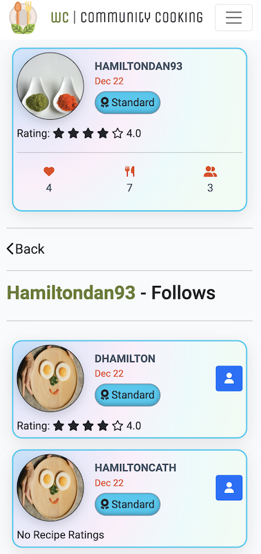
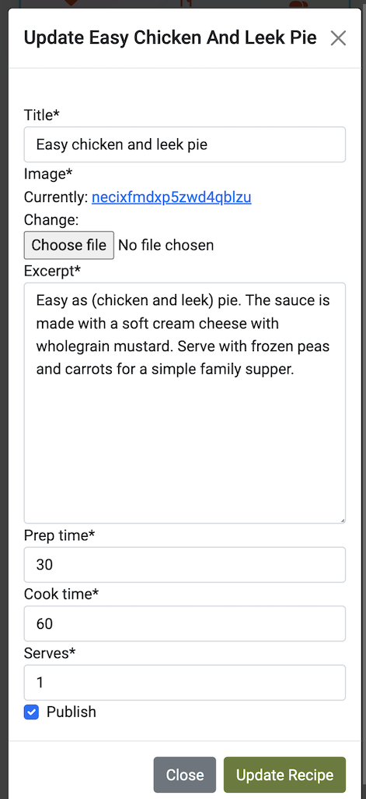

# What's Cooking Testing

[<< Back to ReadMe](README.md)

## Automated Tests

I have 197 tests with 100% coverage of my code.

***

## Manual Tests
Manual testing occurred regularly throughout local development. Tests are documented below.

### index
|Test #|Test|Results|Evidence|
| --- | --- | --- | --- |
|1|Logo heading shortens when screen size is smaller|Pass| The logo changes from WC to what's cooking depending on screen size 
 
 |
|2|Login/ Sign up button disappears when user is logged in|Pass| the button on the index page carousel disappears when the user is logged in and shows up if the user has not been authenticated 
|
|3| profile section appears on user presses profile and is showing the correct user|Pass| in the bar the tab says profile if you are logged in and will say signup/login if you are not logged in 
 
 |
|4| links go to the correct pages|Pass|All links were tested by clicking them |
|5| clicking on the recipes go to the correct recipes|Pass|All links were tested by clicking them|
|6| complete your account notification appears on the user has not complete the account details|Pass| yellow box saying complete your account is shown on the profile side tab is also displayed on the user profile page where the edit button would be. 
 |
|7| complete account details on profile section disappears when user has completed account|Pass| when the user has completed their account the yellow button which says complete account turns into edit account and changes to a green colour 
 |
|8| Account status shows the correct position on the progress bar|Pass| when the user publishes a recipe the bar moves the correct percentage   |
|9| Account status shows the correct colour of award|Pass| the colour of the status and the text of the status changes depending on how many recipes the user has made.   |
|10| contact link navigates to the contact form on the about page|Pass| when the contact button is pressed it navigate to the about us page and uses an anchor to go down to the contact form    |
|11| recipe card has a shadow when higlighted for ux|Pass| When the user highlight over a recipe a shadow behind it appears to make these experience better

 |
### about_us
|Test #|Test|Results|Evidence|
| --- | --- | --- |--- |
|1| contact form has the correct validation|Pass| a user can only send a message when all the relevant fields have been completed|
|2| contact form send email to the admin|Pass| when the user submit the contact form and email appears in the admin inbox|

### logged_in_user_card
|Test #|Test|Results|Evidence|
| --- | --- | --- |--- |
|1| shows the right information for the user page that you were looking at|Pass| the links and the URL is display the correct user and details about the user|
|2| shows the correct colour status for the user|Pass| the status award of the user matches the correct phrase for example a user with 20 recipes will have a silver account|
|3| follow button appears if you are logged in and not following a user|Pass| the follow button shows the correct status depending if you are following I'm not following the user. if you are not logged in the bottom does not sure|
|4| button goes to a mini version showing a icon instead of Word when the screen is on a smaller view|Pass| if you are viewing the page on a mobile device instead of saying following or Unfollow it shows a font awesome icon|

### recipe_detail
|Test #|Test|Results|Evidence|
| --- | --- | --- |--- |
|1| if user is logged in it shows the edit button on their recipes|Pass| edit button only shows up if you are the author of the recipe|
|2| if user is logged in but not on the recipe the edit button does not appear|Pass|edit button only shows up if you are the author of the recipe|
|3| only if the user is logged in can they make a rating|Pass| the rating feature only works if you are authenticated and logged in|
|4| the print button shows the print dialogue so the user can print the recipe|Pass| the print button allows you to open up a print dialogue|
|5| only if user is logged in can they favourite a recipe|Pass| the favourite heart button only works if the user is authenticated|
|6| only if a user is logged in can they upload a image|Pass| upload image button is only visible if you are logged in and authenticated|
|7| a user that has uploaded a image can delete their own image|Pass| a user can only delete the image if they are the person who uploaded the image|
|8| images show on the recipe|Pass| what an image is uploaded it is shown on the correct recipe page|
|9| user can turn on and off comments|Pass| the comment button allows user to toggle on and off the comments linked to that recipe|
|10| only a log in user can leave a comment|Pass| the comment form is only visible when the user is logged in and authenticated|
|11| if the user has written a comment they can only delete their own comment|Pass| a log in authenticated user can only delete a comment that they have made|
|12| header image disappears when the user is on a smaller screen|Pass| the recipe header changes depending on the view size|
|13| splide images change how many are on screen depending on the view size|Pass| the slide feature displays the recipes and users depending on the view size|

### recipes
|Test #|Test|Results|Evidence|
| --- | --- | --- |--- |
|1| links go to the correct pages|Pass|All links were tested by clicking them|
|2| recipes link to the correct recipes|Pass|All links were tested by clicking them|
|3| the page pagination works|Pass|the pagination for the recipes shows correctly|
|4| sort and filter show results in the correct order|Pass| the sort and filter options were tested and showed the correct results|
|5| search shows the correct recipes|Pass| the search function shows the correct recipes|

### user_favourites
|Test #|Test|Results|Evidence|
| --- | --- | --- |--- |
|1| recipes link to the correct recipe pages|Pass|All links were tested by clicking them|
|2| Page pagination works correctly|Pass|the pagination for the recipes shows correctly|

### user_followers
|Test #|Test|Results|Evidence|
| --- | --- | --- |--- |
|1| correct users are shown in the following pages|Pass| the correct users were shown on the correct following pages|
|2| correct user rating is shown on the page|Pass| the correct rating was calculated|

### user_profile_page
|Test #|Test|Results|Evidence|
| --- | --- | --- |--- |
|1| user can edit account if they are on their own account|Pass| the edit account button is only shown if you are on the account proile page of the account you are logged in as|
|2| edit account shows a following or follow button if you are logged in|Pass| if you are not on your own profile page it shows if you are following or not following that user|
|3| splide changes size depending on how big the view is|Pass| the correct number of items are shown when the view size is changed|
|4| all links go to the correct pages|Pass|All links were tested by clicking them|

### user_recipe_add
|Test #|Test|Results|Evidence|
| --- | --- | --- |--- |
|1| the form has the correct validation|Pass| the form needs all required fields to be complete before it is submitted|
|2| sign postage is shown at the top of the form|Pass| there are clear instructions on how to add a new ingredient and how to write a new method for a recipe|

### user_recipes_edit
|Test #|Test|Results|Evidence|
| --- | --- | --- |--- |
|1| knows if the recipe is published or not|Pass| there is a clear green or red text to show the user if the recipe is published or hidden|
|2| shows what ingredients are verified|Pass| the recipes that are not verified show a white symbol or underlined|
|3| ingredient pagination works correctly|Pass| the pagination for the ingredients works correctly when the user searches for them|
|4| add an ingredient button only appears when less than 10 items show up in the search|Pass| when searching for an ingredient when the search results is are less than 10 it will show the user a button/option to add a new ingredient because it is not in the database|

### user_recipes
|Test #|Test|Results|Evidence|
| --- | --- | --- |--- |
|1| recipes link to the correct recipe pages|Pass|All links were tested by clicking them|
|2| Page pagination works correctly|Pass| the pagination for the recipes shows correctly|
|3| shows a colour around the recipe if it has been published or not only if you are logged in to your recipes|Pass| a green box is shown if a recipe has been published a read books is so if it is hidden|

***

## User Story Testing

[Project Stories](https://github.com/users/dlhamilton/projects/3)

[User story 1]([#1](https://github.com/dlhamilton/Whats-Cooking/issues/1)) - I know I am done with the 'As a Site Admin, I can approve or disapprove comments so that I can filter out objectionable comments' user story when I can access a list of all comments submitted on the app and If I mark a comment as 'disapproved', it is hidden from public view. - PASS

[User story 2]([#2](https://github.com/dlhamilton/Whats-Cooking/issues/2)) - I know I am done with the 'As a Site Admin, I can approve or disapprove ingredients, so that I can filter out objectionable ingredients' user story when I can access the 'Ingredients' section of the app's admin panel and the app displays a list of all ingredients that have been submitted by users. If I approve an ingredient, the app adds it to the list of approved ingredients and allows users to add it to their recipes. - PASS

[User story 3]([#3](https://github.com/dlhamilton/Whats-Cooking/issues/3)) - I know I am done with the 'As a Site Admin, I can remove recipes, so that I can filter out objectionable recipes' user story when I can access the 'Recipes' section of the app's admin panel, The app displays a list of all recipes that have been submitted by users and the app marks each recipe as 'Published' by default, until I review and remove it if necessary. - PASS

[User story 4]([#4](https://github.com/dlhamilton/Whats-Cooking/issues/4)) - I know I am done with the 'As a Site Admin, I can view the number of favourites on each post, so that I can see which is the most popular or viral' user story when The app displays a list of all the recipes that have been submitted by users and shows the total number of favourites on the recipe. - PASS

[User story 5]([#5](https://github.com/dlhamilton/Whats-Cooking/issues/5)) - I know I am done with the 'As a Site Admin, I can create, read, update and delete recipes so that I can manage my app content' user story when the app updates the list of recipes in real-time, as I create, update or delete recipes, and shows the changes in a clear and consistent way. - PASS

[User story 6]([#6](https://github.com/dlhamilton/Whats-Cooking/issues/6)) - I know I am done with the 'As a Site User, I can view comments on an individual recipe so that I can read the conversations' user story when the app shows a section or tab labeled 'Comments' below the recipe's, where all comments related to the recipe are displayed in chronological order. - PASS

[User story 7]([#7](https://github.com/dlhamilton/Whats-Cooking/issues/7)) - I know I am done with the 'As a Site User, I can create draft recipes so that I can finish writing the content later' user story when the app provides a 'Create Recipe' button or link that allows me to access the recipe creation form and the recipe creation form allows me click a 'publish' button and it stores the input data in the database, without publishing the recipe to the public or other users. - PASS

[User story 8]([#8](https://github.com/dlhamilton/Whats-Cooking/issues/8)) - I know I am done with the 'As a Site User, I can add new ingredients to the main list so that I can use them in my recipes' user story when the app provides a user-friendly interface for me to add new ingredients to the main list, such as a form or modal window. The app stores the new ingredient in a database waiting for the admin to approve it. - PASS

[User story 9]([#9](https://github.com/dlhamilton/Whats-Cooking/issues/9)) - I know I am done with the 'As a Site User, I can add new ingredients to my shopping list so that I can know what I need to purchase to make the meal' user story when the app provides a user-friendly interface for me to add new ingredients to my shopping list, such as a button or link that I can click on while viewing a recipe or a list of recipes. - DELAYED

[User story 10]([#10](https://github.com/dlhamilton/Whats-Cooking/issues/10)) - I know I am done with the 'As a Site User I can add ingredients to a recipe so that readers know what they will need for the recipe.' when A logged in Site User can navigate to the recipe creation page and add ingredients to the recipe form.
The ingredient list is saved with the recipe and is displayed on the recipe detail page and site Users can view the list of ingredients required to make a recipe. - PASS

[User story 11]([#11](https://github.com/dlhamilton/Whats-Cooking/issues/11)) - I know I am done with the 'As a Site User I can add instructions on how to cook a recipe so that users can follow and make the recipe.' when A logged in Site User can navigate to the recipe creation page and add instructions to the recipe form.
The instructions are saved with the recipe and are displayed on the recipe detail page and site Users can view the step-by-step instructions on how to make a recipe. - PASS

[User story 12]([#12](https://github.com/dlhamilton/Whats-Cooking/issues/12)) - I know I am done with the 'As a Site User I can post a recipe so that users can view the recipe and try and make it them self.' when a logged in Site User can navigate to the recipe creation page and fill out the recipe form including adding a recipe name, ingredients, methods, cooking time, and an image. The recipe is saved and displayed on the recipes page and the recipe detail page. Site Users can view the recipe details, including the recipe name, ingredients, instructions, cooking time, and image. They can also favorite or comment on the recipe. - PASS

[User story 13]([#13](https://github.com/dlhamilton/Whats-Cooking/issues/13)) - I know I am done with the 'As a Site User I can print/ export my shopping list so that I can know what I need to purchase to make the meal.' when a logged in Site User can navigate to the shopping list page and see all the ingredients they have added to their shopping list. The shopping list page provides an option to export or print the list, allowing the user to view the list in a printable format or download it as a PDF or spreadsheet. The exported list includes all the ingredients in a clear and organized format, making it easy for the user to go shopping and purchase the necessary ingredients for the recipe. - DELAYED

[User story 14]([#14](https://github.com/dlhamilton/Whats-Cooking/issues/14)) - I know I am done with the 'As a Site User I can print/ export a recipe so that I can use it when i want to make the recipe.' when a "Print" button is available on each recipe page. Clicking on the "Print" button opens a printer-friendly version of the recipe. The printer-friendly version includes the recipe title, ingredients, instructions, and any additional notes or tips. The printer-friendly version is formatted to fit on a standard piece of paper or can be saved as a PDF. The printed or exported recipe contains all necessary information for the user to successfully make the recipe. - PASS

[User story 15]([#15](https://github.com/dlhamilton/Whats-Cooking/issues/15)) - I know I am done with the 'As a Site User I can favourite/ unfavourite recipes so that I can interact and save the recipe to make.' when a logged-in user can click on a "favorite" button/icon on a recipe's detail page to mark it as a favorite recipe. A logged-in user can see a list of their favorite recipes in their user profile. A logged-in user can remove a recipe from their favorites by clicking on an "unfavorite" button/icon on the recipe's detail page or from their favorites list. The number of times a recipe has been favorited is displayed on the recipe's detail page for all users to see. The site admin can view a list of the most favorited recipes in the admin panel to help understand user preferences and interests. - PASS

[User story 16]([#16](https://github.com/dlhamilton/Whats-Cooking/issues/16)) - I know I am done with the 'As a Site User I can search for recipes so that I can interact and save the recipe to make.' when the search function is implemented and allows the user to search for recipes based on keywords, ingredients. The search results are relevant and displayed in an organized manner. - PASS

[User story 17]([#17](https://github.com/dlhamilton/Whats-Cooking/issues/17)) - I know I am done with the 'As a Site User I can search for recipes with ingredients so that I can interact and save the recipe to make.' when a user can select one or more ingredients in the fitler tab and hit "search" button to get a list of recipes that contain those ingredients. - PASS

[User story 18]([#18](https://github.com/dlhamilton/Whats-Cooking/issues/18)) - I know I am done with the 'As a Site User I can leave a comment on a recipe so that I can leave a review on the recipe and give feedback.' when the "Add Comment" feature is implemented on the recipe page. Users can leave a comment with a minimum and maximum character limit. Comments are displayed below the recipe and sorted by date. Users can edit or delete their own comments. - PASS

[User story 19]([#19](https://github.com/dlhamilton/Whats-Cooking/issues/19)) - I know I am done with the 'As a Site User I can view a paginated list of recipes so that I can easily select a recipe to view.' when I implement pagination functionality for the recipe list view, with a set number of recipes displayed per page. Ensure that the pagination navigation is user-friendly and intuitive, with clear links to navigate to the next and previous pages. - PASS

[User story 20]([#20](https://github.com/dlhamilton/Whats-Cooking/issues/20)) - I know I am done with the 'As a Site User I can view a paginated list of ingredients so that I can easily select an ingredient to view recipes linked to it.' when the user can access the paginated list of ingredients from the recipes page menu and select what ingridents to filter the recipes by. - PASS

[User story 21]([#21](https://github.com/dlhamilton/Whats-Cooking/issues/21)) - I know I am done with the 'As a Site User I can view a list of recipes so that I can easily select a recipe to read.' when a Site User navigates to the "Recipes" page, they should be presented with a list of all available recipes in the system. The list should display the name, a brief description, and an image (if available) for each recipe. Each recipe should be clickable, allowing the user to view the full recipe details. - PASS

[User story 22]([#22](https://github.com/dlhamilton/Whats-Cooking/issues/22)) - I know I am done with the 'As a Site User I can view a list of ingredients so that I can easily select an ingredient to read.' when I can view a list of ingredients so that I can easily select an ingredient to read. When viewing the list of ingredients, I can see the name of each ingredient. I should be able to click on any ingredient in the list to add it to the filter criteria - PASS

[User story 23]([#23](https://github.com/dlhamilton/Whats-Cooking/issues/23)) - I know I am done with the 'As a Site User I can view the number of favourites on each recipe so that I can see which is the most popular or viral.' when  I view a recipe, I can see the number of times it has been favorited by other users. This will be displayed prominently on the recipe page, allowing me to easily see which recipes are the most popular or viral. Once I can see the number of favorites on each recipe, I know that this feature is complete - PASS

[User story 24]([#24](https://github.com/dlhamilton/Whats-Cooking/issues/24)) - I know I am done with the 'As a Site User I can view the most popular recipes so that I can try the recipes.' when the app displays a list of recipes ordered by the number of favourites. The list shows the recipe title, image, and number of favourites. Each recipe in the list is clickable and takes the user to the recipe details page. - PASS

[User story 25]([#25](https://github.com/dlhamilton/Whats-Cooking/issues/25)) - I know I am done with the 'As a Site User I can view the 5 top recipes so that I can try the most popular recipes.' when the app displays a list of the top 5 most popular recipes based on the number of favorites. Each recipe card in the list shows the recipe name, an image of the dish, a brief description, and the number of favorites. Clicking on a recipe card takes the user to the recipe page. The list is sorted in descending order based on the number of favorites, with the most popular recipe at the top. - PASS

[User story 26]([#26](https://github.com/dlhamilton/Whats-Cooking/issues/26)) - I know I am done with the 'As a Site User I can register an account so that I can use the site to share and view recipes.' when a registration form is created for the user to input their username, email, and password. The registration form includes validation to ensure that the user's information is valid and unique. Once the user submits the form, their account is created and they are redirected to the login page. An email is sent to the user's provided email address to verify their account. The user can login with their registered email and password. The user can view their account information and make changes if needed. The user can logout from their account. - PASS

[User story 27]([#27](https://github.com/dlhamilton/Whats-Cooking/issues/27)) - I know I am done with the 'As a Site User I can view the top 5 ingredients used in recipes so that I know what ingredients I will use the most.' when a page is available to the user which lists the top 5 ingredients used in the recipes. The list is calculated based on the frequency of each ingredient used in all the recipes in the app. The ingredients are displayed with their name and a count of the number of times they have been used. - PASS

[User story 28]([#28](https://github.com/dlhamilton/Whats-Cooking/issues/28)) - I know I am done with the 'As a Site User I can view comments on an individual recipe so that I can read the conversations and reviews.' when the recipe detail page displays a list of comments related to the recipe. Each comment includes the name of the user who left it, the comment text, the date and time it was posted. - PASS

[User story 29]([#29](https://github.com/dlhamilton/Whats-Cooking/issues/29)) - I know I am done with the 'As a Site User I can click on a recipe title so that I can read the full recipe.' when the site user can click on the title of a recipe from the recipe list or search results and is directed to a page displaying the full recipe details, including the recipe name, image, description, ingredients, instructions, and any other relevant information. The full recipe page is visually appealing, well-formatted, and easy to read and navigate, with clear headings, subheadings, and sections. The full recipe page displays the comments and ratings from other users, if any, allowing the site user to read the reviews and feedback before trying the recipe. The full recipe page includes buttons or links to allow the site user to add the recipe to their favourites, share the recipe on social media, or print the recipe for later use. The full recipe page is responsive and mobile-friendly, allowing the site user to easily access and read the recipe from their smartphone or tablet. - PASS

[User story 30]([#30](https://github.com/dlhamilton/Whats-Cooking/issues/30)) - I know I am done with the 'As a Site User I can create, read, update and delete posts that I manage so that I can manage my recipe content.' when A logged-in Site User can access a page to create a new recipe.The recipe creation form includes fields for recipe title, description, ingredients list, cooking instructions, and an option to upload a photo.The form includes validation to ensure all required fields are filled out and that ingredient names and quantities are properly formatted.A logged-in Site User can access a page to view their own recipes and see a list of their existing recipes with options to edit or delete each one.The edit form should pre-populate with the existing recipe information and allow the user to make updates to any field.The delete function should confirm the action with the user before deleting the recipe permanently.Other Site Users cannot edit or delete recipes they did not create.A logged-in Site User can access a page to view all existing recipes and see a list of all recipes with options to view, favourite or unfavourite each one.A logged-in Site User can favourite or unfavourite a recipe and the favourite count should update in real-time without needing to refresh the page.A logged-in Site User can view their list of favourite recipes and remove recipes from their favourites list. - PASS

[User story 31]([#31](https://github.com/dlhamilton/Whats-Cooking/issues/31)) - I know I am done with the 'As a user, I want to be able to update my profile information so that my followers can get to know me better.' when a user can access their profile information. A user can edit and update their profile information, such as their name, bio, profile picture, and contact information. Any changes made to the user's profile information are saved and reflected on their public profile page. The user's public profile page displays their updated profile information for other users to view. - PASS

[User story 32]([#32](https://github.com/dlhamilton/Whats-Cooking/issues/32)) - I know I am done with the 'As a user, I want to be able to view detailed information about a recipe, including the ingredients, instructions, and user reviews, so that I can decide if I want to make the recipe.' when the detailed recipe view page shows the recipe's name, image, description, ingredients, and instructions. The recipe's ingredients are listed with the required quantity and unit of measurement. The recipe's instructions are presented in a clear and easy-to-read format. The recipe's user reviews and ratings are displayed, allowing users to read feedback and decide if they want to try the recipe. Users can navigate to the recipe creator's profile from the recipe view page. - PASS

[User story 33]([#33](https://github.com/dlhamilton/Whats-Cooking/issues/33)) - I know I am done with the 'As a Site User, I can log into an account, so that I can view all my recipes' user story when I can access the 'Log In' feature from the app's homepage or navigation bar, by clicking on a button or link labeled 'Log In' or 'Sign In'. I am directed to a secure login page that requires me to enter my username and password, or authenticate using a third-party service such as Google or Facebook, then the app validates my credentials and checks if my account is active and verified, and if so, logs me in and redirects me to my profile page. - PASS

[User story 34]([#34](https://github.com/dlhamilton/Whats-Cooking/issues/34)) - I know I am done with the 'As a Site User, I can follow or unfollow another user's account, so that I can view all their recipes or I can stop following a user' user story when I can access the 'Follow' or 'Unfollow' feature from any user's profile page. - PASS

[User story 35]([#35](https://github.com/dlhamilton/Whats-Cooking/issues/35)) - I know I am done with the 'As a Site User, I can upload pictures of the recipe if I have tried to make it, so that other users can see an example of the meal' user story when I can access the 'Upload Picture' feature on the recipe page for any recipe I have tried to make and I can select a picture file from my device and displays my picture and comment alongside the recipe, in a designated section. - PASS

***

## Code Validation

### HTML
#### index
https://validator.w3.org/nu/?showsource=yes&showoutline=yes&showimagereport=yes&doc=https%3A%2F%2Fwhats-cooking.herokuapp.com%2F#l441c6
#### about_us
https://validator.w3.org/nu/?showsource=yes&showoutline=yes&showimagereport=yes&doc=https%3A%2F%2Fwhats-cooking.herokuapp.com%2Faboutus%2F
#### recipe_detail
https://validator.w3.org/nu/?showsource=yes&showoutline=yes&showimagereport=yes&doc=https%3A%2F%2Fwhats-cooking.herokuapp.com%2Frecipes%2F2-easy-chicken-and-leek-pie%2F#l125c27
#### recipes
https://validator.w3.org/nu/?showsource=yes&showoutline=yes&showimagereport=yes&doc=https%3A%2F%2Fwhats-cooking.herokuapp.com%2Frecipes%2F#l441c6
#### user_favourites
https://validator.w3.org/nu/?showsource=yes&showoutline=yes&showimagereport=yes&doc=https%3A%2F%2Fwhats-cooking.herokuapp.com%2Fusers%2Fhamiltondan93%2Fmyfavourites%2F#l125c27
#### user_followers
https://validator.w3.org/nu/?showsource=yes&showoutline=yes&showimagereport=yes&doc=https%3A%2F%2Fwhats-cooking.herokuapp.com%2Fusers%2Fhamiltondan93%2Fmyfollowers%2F#l125c27
#### user_profile_page
https://validator.w3.org/nu/?showsource=yes&showoutline=yes&showimagereport=yes&doc=https%3A%2F%2Fwhats-cooking.herokuapp.com%2Fusers%2Fhamiltondan93%2F#l125c27
#### user_recipes
https://validator.w3.org/nu/?showsource=yes&showoutline=yes&showimagereport=yes&doc=https%3A%2F%2Fwhats-cooking.herokuapp.com%2Fusers%2Fhamiltondan93%2Fmyrecipes%2F#l125c27

### CSS
https://jigsaw.w3.org/css-validator/validator?uri=https%3A%2F%2Fwhats-cooking.herokuapp.com%2F&profile=css3svg&usermedium=all&warning=1&vextwarning=&lang=en

### JavaScript
#### recipe_detail.js
No errors were found when passing through the official Jshint validator
- There are 23 functions in this file.
- Function with the largest signature take 1 arguments, while the median is 1.
- Largest function has 9 statements in it, while the median is 2.
- The most complex function has a cyclomatic complexity value of 4 while the median is 1.
#### recipes.js
No errors were found when passing through the official Jshint validator
- There are 3 functions in this file.
- Function with the largest signature take 1 arguments, while the median is 0.
- Largest function has 9 statements in it, while the median is 7.
- The most complex function has a cyclomatic complexity value of 2 while the median is 1.
#### sendEmail.js
No errors were found when passing through the official Jshint validator
- There are 7 functions in this file.
- Function with the largest signature take 1 arguments, while the median is 1.
- Largest function has 3 statements in it, while the median is 1.
- The most complex function has a cyclomatic complexity value of 1 while the median is 1.
#### user_profile_page.js
No errors were found when passing through the official Jshint validator
- There are 2 functions in this file.
- Function with the largest signature take 0 arguments, while the median is 0.
- Largest function has 1 statements in it, while the median is 1.
- The most complex function has a cyclomatic complexity value of 1 while the median is 1.
#### user_recipes_edit.js
No errors were found when passing through the official Jshint validator
- There are 12 functions in this file.
- Function with the largest signature take 2 arguments, while the median is 1.
- Largest function has 11 statements in it, while the median is 3.
- The most complex function has a cyclomatic complexity value of 3 while the median is 1.

### Python
The standard testing PEP8 Online is currently down so I used the PEP8 validator extension within gitpod. The results are shown below:

| App/Parent folder | File | Result |
| --- | --- | --- |
| socialrecipe | admin.py | No errors 2 warnings - unused arguments |
| socialrecipe | apps.py | No errors No warnings |
| socialrecipe | forms.py | No errors No warnings no-member - Not an error "Class '_' has no 'objects' member. it's just a warning from VSC. Django adds that property dynamically to all model classes |
| socialrecipe | models.py | No errors 3 warnings - unused arguments no-member - Not an error "Class '_' has no 'objects' member. it's just a warning from VSC. Django adds that property dynamically to all model classes |
| socialrecipe | test_forms.py | No errors No warnings no-member - Not an error "Class '_' has no 'objects' member. it's just a warning from VSC. Django adds that property dynamically to all model classes |
| socialrecipe | test_models.py | No errors No warnings no-member - Not an error "Class '_' has no 'objects' member. it's just a warning from VSC. Django adds that property dynamically to all model classes |
| socialrecipe | test_views.py | No errors 3 warnings - Too many lines protected access(used to get access to messages for tests),  no-member - Not an error "Class '_' has no 'objects' member. it's just a warning from VSC. Django adds that property dynamically to all model classes |
| socialrecipe | urls.py | No errors No warnings |
| socialrecipe | views.py | No errors 2 warnings - unused arguments no-member - Not an error "Class '_' has no 'objects' member. it's just a warning from VSC. Django adds that property dynamically to all model classes |

I also use the code Institute python Linter the results are shown below.

#### admin.py

#### apps.py

#### forms.py

#### models.py

#### testing_forms.py

#### testing_model.py

#### testing_views.py

#### urls.py

#### views.py

***

## Lighthouse/ Accessibility Testing
With the Lighthouse tests there were some low performance issues due to the images and the size of the images it is something that I have mentioned in future features to the project where we can control the quality, the file size and the scaling ratio for the images. There was also some best practices that could've been improved and it came to the scaling of the images again this was mentioned in future features. The accessibility and the SEO for all pages were in the green.
### index

### about_us

### recipe_detail

### recipes

### user_favourites

### user_followers

### user_profile_page

### user_recipe_add

### user_recipes_edit

### user_recipes

***

## Devices used for manual testing
What's Cooking was tested using the following desktop and mobile browsers:

### Desktop
- Safari 15.6.1
- Firefox 109.0
- Chrome 109.0.5414.119

### Mobile and Tablet
- Safari iOS 16.3
- Chrome 112 for Android

[<< Back to ReadMe](README.md)